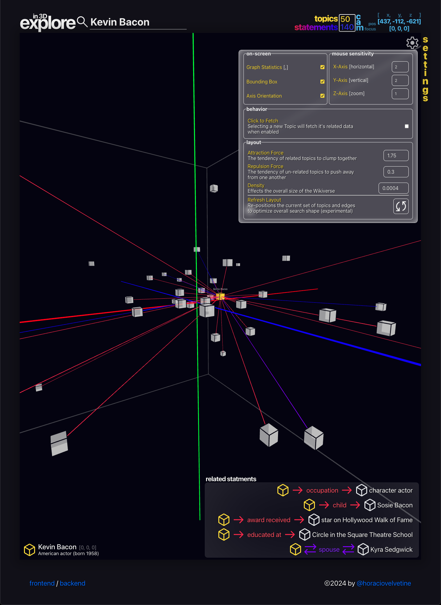

# Devlog 2: September 8-14, 2025

Last week's update set the expectation of a feature outline, so this week I immediately jumped into bootstrapping the backend API with no planning. What can I say, I like writing code, and planning is always less appealing. But I suppose since the post will be written regardless... It will include the promised feature outline, but also some of outlining of the code written over the course of standing up a new API repository.

## The Prototype in the Room



The Alpha of this project was deployed to be shared with a handful of people for testing in the latter half of 2024. These tests were informal and were used as a chance to get feedback about the UI/UX, test the performance across a variety of devices, and get ideas for improvements that would make it more useful. Towards the beginning of the year in 2025 some breaking changes happened in [the Wikidata Toolkit](https://github.com/Wikidata-Toolkit/Wikidata-Toolkit), (somewhat) officially marking the end of the Alpha testing. This break in the development cyclce provided some time to reflect, focus on other projects, and take a break to think about next steps for the Wikiverse.

In general, the next steps fell into 3 distinct categories:

1. Development: a `Beta` release with a well defined features list
2. Communnity: Joining the 'Meta-Wiki' (the Wikimedia Foundation's social network) community to seek feedback and present my work
3. Funding: Exploring potential grant opportunities offered by the Wikimedia Foundation to potentially handle hosting costs

Having established these categories I patiently waited to jump back in and did not immediately stand up a new Spring Boot application in an effort to determine what happened with the breaking changes.

## The Breaking Changes

As it turns out [the issue](https://github.com/Wikidata-Toolkit/Wikidata-Toolkit-Examples/issues/7) was a [non-issue](https://github.com/Wikidata-Toolkit/Wikidata-Toolkit-Examples/pull/8) easily solved by updating the library to the newest version. Fortunately, this meant the 'breaking changes' would not be any sort of problem going forward, mini-crisis averted. However, through submitting the above issue I was able to get in touch with the maintainer of the library and even [contribute](https://github.com/Wikidata-Toolkit/Wikidata-Toolkit/pull/966) some of my own code to the Wikidata Toolkit! I'm mentioning this because this ended up being my first open-source contributions as a developer, and was an enormously rewarding feeling. The code contributed is meant to help newcomers to the library be able to get an idea for the shape of the data, and adds comments to help explain the [`FetchOnlineDataExample.java`](https://github.com/Wikidata-Toolkit/Wikidata-Toolkit/blob/master/wdtk-examples/src/main/java/org/wikidata/wdtk/examples/FetchOnlineDataExample.java).

## Features and Folley

After a few attempts it feels like the best way to list out features is to go over the 'what'  
from the perspective of the frontend i.e. 'What does each thing in the frontend do?'

### **UI/UX Components**

Each of these components comprises a small piece of the overall UI/UX the user will interact with, and a few key details about what they should do. For now this is meant to be a high level and abstract overview of these components. Components may be subject to change over the course of the project, as often times 'the best' solution for UI becomes clear over the course of testing and iterating.

#### **Hovered Vertex Details**

```
  - Title / Description display
  - Shows related edge connections in Vis
```

#### **Selected Vertex Details**

```
  - Title / Description of Selected Vertex
  - Links to source Wiki page
  - Visually mirror the 'selected' Vertex in vis
  - Provide additional 'right-click' menu interactions:
    - Add / Edit / Remove from Groups
    - Hide / Show Vertex
    - Lock Vertex positions
```

#### **Related Edges Details**

```
  - Scrollable list of Edge Relationships
  - Communicate directionality of vertex relationships
  - Clickable Vertex targets highlight Vertex in vis
  - Property click to define/display property (w/ desc.)
  - Visually mirror the 'selected' Vertex in vis vs. non-selected Vertices
```

#### **Graph Search Input**

```
  - Searches the current dataset for matches
  - Highlight/Target relevant match
  - Result list similar to original search to allow user to select
```

#### **Interaction History**

```
  - Track user selections for easy backtracking
  - User configureable number of interactions stored
  - Clicking an interaction highlights the target entity
```

#### **Graphset Summary Overview**

```
  - Summarize count details about the graph
  - Live camera position for 3D mode
  - Framerate indicator
```

#### **New Search Input**

```
  - Input for starting search over
  - Initial results selection list
```

#### **Right Click Menu**

```
  - Add vertex to group
  - Remove vertex from graph (adds to filter)
  - Show/Hide vertex from view
  - Open Wiki source page
  - Lock vertex position
```

#### **Settings Menu(s):**

Tabbed layout under a single menu display component

##### **Sketch Behavior Menu:**

```
  - Fetch related on click
  - Display bounding box
  - Display orientation axis
  - 2D or 3D layout
  - Target language
  - Interaction history length
```

##### **Data Filters:**

```
  - Excluded data w/ optional notes
  - Add / edit / remove data
  - QID specific targets
  - Keyword specific targets
  - Data-type specific targets
```

##### **Group Details:**

```
  - Visual identifier settings (channel TBD)
  - Keep group selected highlighted
  - Add / edit / remove Vertices
  - Group lock/unlock positions
  - Reduce graphset to selected group
  - Show / Hide group bounding box
```

##### **Layout Settings:**

```
    - Attraction multiplier
    - Repulsion multiplier
    - Data density
    - Maximum layout iterations
    - Maximum iteration movement
    - Temperature curve multiplier
    - Force adjustment multipliers
```

### Landing/Home Page

Primary landing for the application, should re-create the functionality of the [Wikipedia](www.wikipedia.org) homepage.

```
  - Primary search input
  - Target Wiki language select
  - Provide initial results list to select from
  - De-bounce initial results to serve in real-time
  - Links to About `Wikiverse` page
  - Links to Tutorial page
  - Active background from prototype
```

### About Page

Answer the what, how, and why of using the Wikiverse. Provide screenshots where applicable.

### Tutorial Page

A 'narrative' tutorial and introduction to the Wikiverse UI/UX and how it can be used. Builds on features introducing them naturally to be accessible for any kind of user regardless of their relationship with technology. Use the real visualization as a guided tutorial

## Wrapping It Up

The above features are a mix between some things which have already been implemented as a part of the prototype and new features derived from feedback and using the prototype. One of the most rewarding things to hear about the prototype was that it 'was a rabbit hole generator', where users expressed it was an engaging in that fun addictive kind of way. More than anything the goal for this `Beta` will be to build on that feeling, and continue to build something that is engaging and useful for people who love discovering new things, just like me. 

Brb @horaciovelvetine